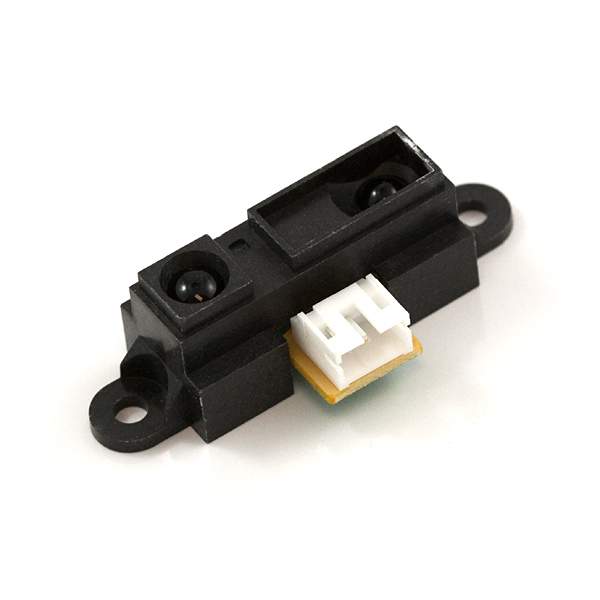

# Arduino Pick and Place Robotic Arm 
Designed and programmed (in C++) a pick and place robot using an Arduino, sensors, circuits, and reverse engineered a Mindstorms NXT kit using an Oscilloscope

  

# Motivation
This was for a Mechatronics project. Me and my partner could create anything, we weren't allowed to use most of the built in functions in the Arduino IDE so we could learn how to write code that will work directly with microprocessors. We ambitiously chose to Design and program (in C++) a pick and place robot using an Arduino, sensors, circuits, and reverse engineer a Mindstorms NXT kit using an Oscilloscope 

# Table of Contents

1. Circuit
2. Mindstroms NXT
3. IR Range Sensor 
4. Results
 

# 1. Circuit
The main circuits we will use are H bridges, a multiplexer, an inverter, and an amplifier. The H bridges will be used to protect the Arduino. The multiplexer will be used to choose one of the three motors to send the pwm signals. The multiplexer inverted the signals so we had to also use an inverter to get the correct signals. We will have to hook up the circuit to a power supply to power the motors since they run on nine volts. 

  

### Circuit Design

  

# 2. Mindstroms NXT

We reversed engineered the Mindstorms NXT using an oscilloscope and made it work with an arduino.

  

### Motors
Reverse engineered and calibrated an NXT motor to work with the arduino.

  

### Touch Sensors
Reverse engineered and calibrated an NXT touch sensor to work with the arduino.

  

### (Optional) Light Sensor from NXT
Reverse engineered and calibrated an optional light sensor that can tell the color of the objects it is about to pick up.

  

# 3. IR Range Sensor
Calibrated and used an IR Range Sensor to detect where each object is. The ATD h file handles this.

  

# 4. Results

  

For further questions please refer to my LinkedIn profile or contact me here on GitHub. 

